# python-git

## Doctests

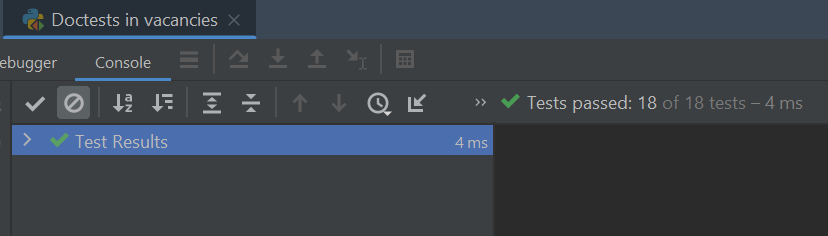

## Unit tests

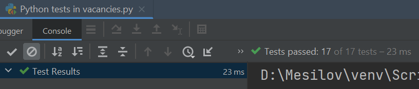

## profiling
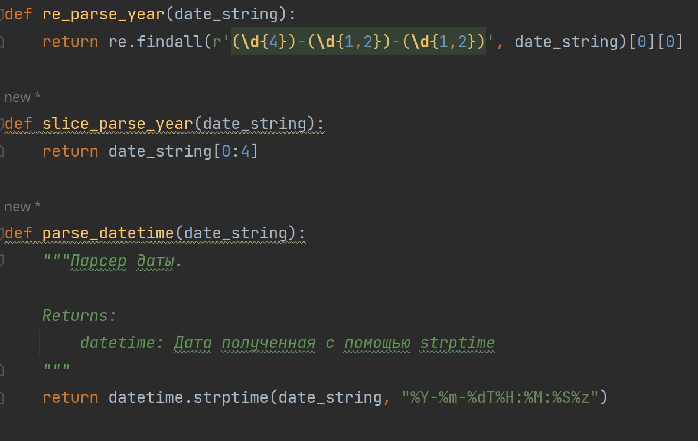
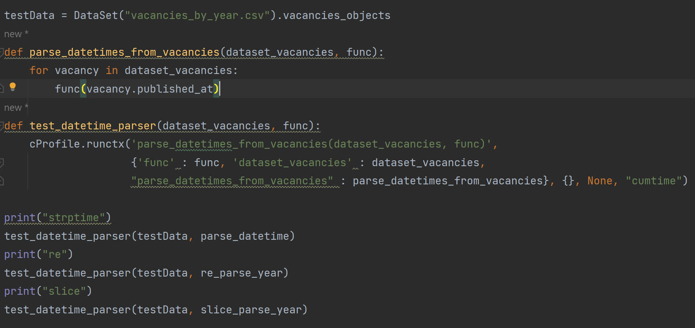

### datetime.strptime 
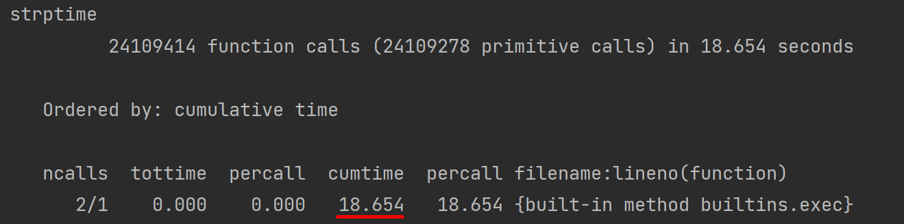

### re
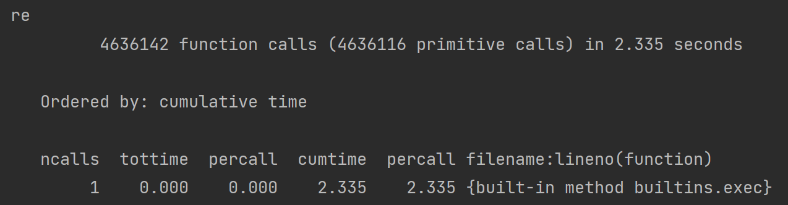

### string slice [:]
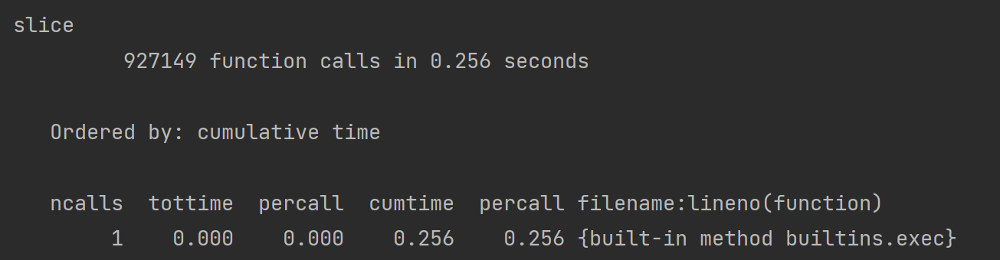

## Chunk-splitter result
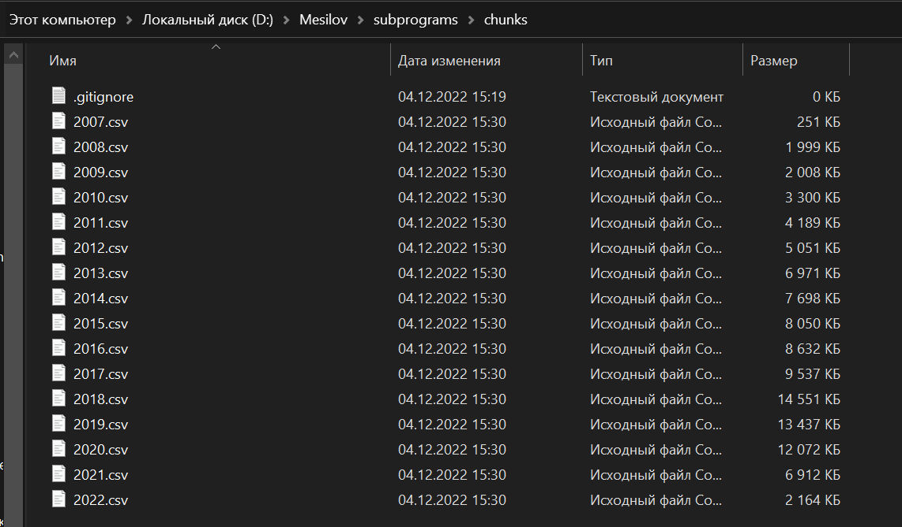</img>
### dif_currencies_chunks
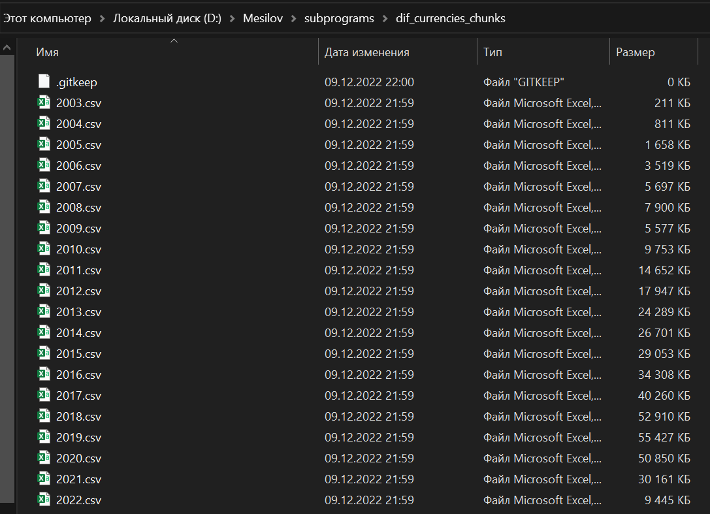</img>

## Mutiprocessing benchmark

### without muiltiprocessing
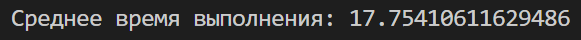</img>

### multiprocessing module
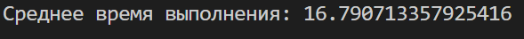

### concurrent.futures module
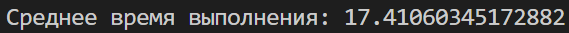

## salary_currency value_counts
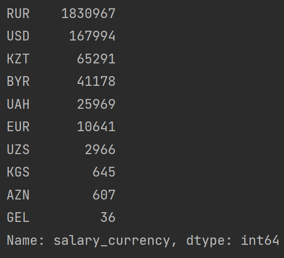</img>
`>5000`: USD, KZT, BYR, UAH, EUR